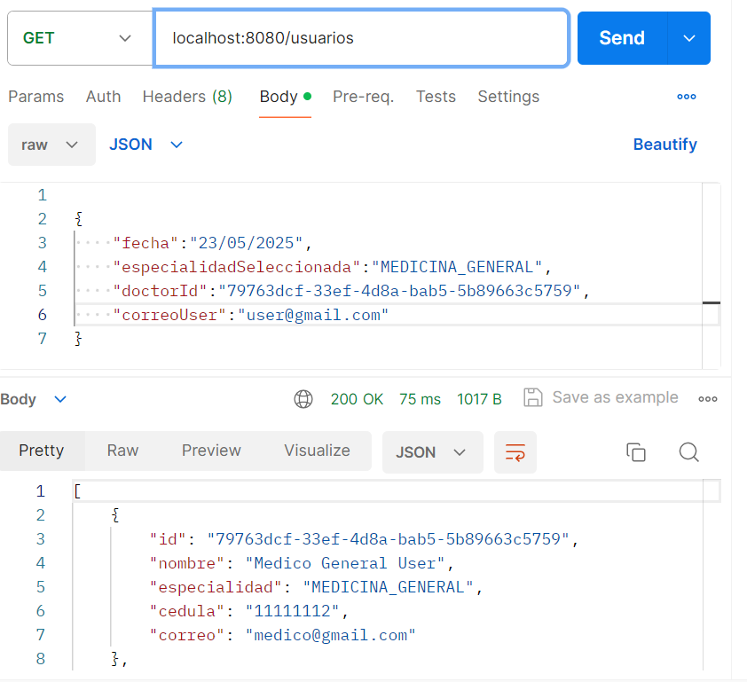
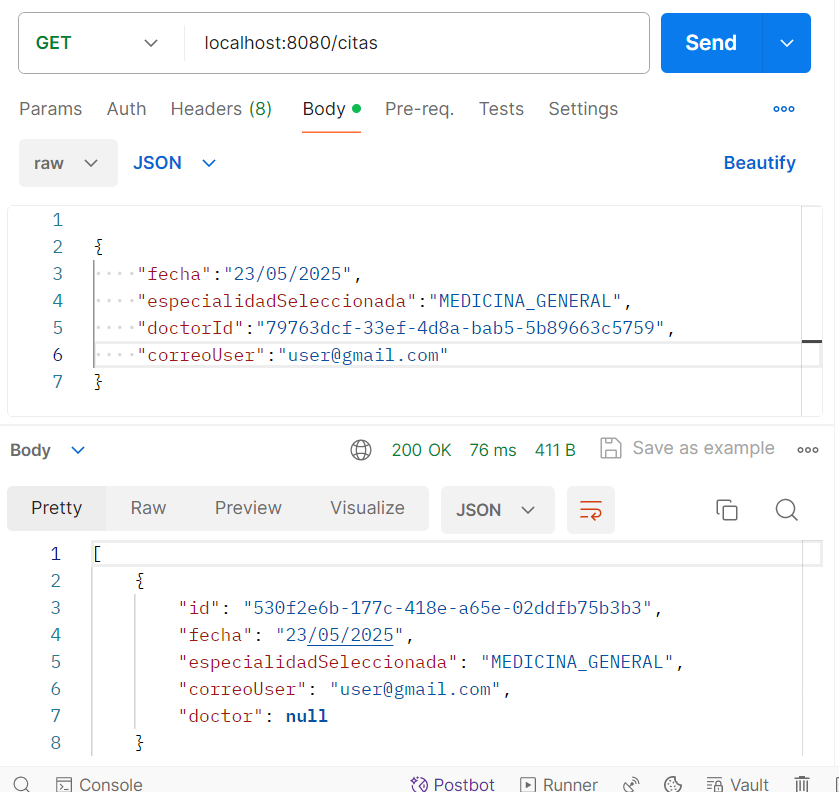
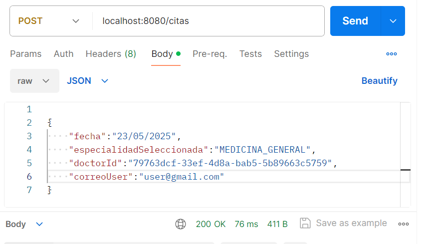

David Stiven Sarria Arcila

Instrucciones para ejecutar

mvn clean package para compilar el proyecto   
Luego para ejecutar el backend de forma local se puede ejecutar  
mvn spring-boot:run

Pero tambien se puede probar el backend desplegado usando la url https://parcialtercertercio-gvhgdjagcrbxcfes.mexicocentral-01.azurewebsites.net/

luego de la URL se puede usar "usuarios" para buscar todos los usuarios, asi mismo como buscar por id   
o por correo segun muestran las imagenes

Tambien se puede consultar y crear Citas medicas de usando "citas" y al igual que con usuarios se pueden crear y consultar segun lo deseado.

  

